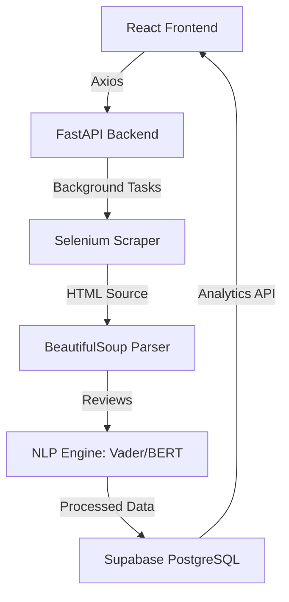

# ReviewRadar AI 🛰️


**ReviewRadar AI** is a state-of-the-art product intelligence platform that transforms raw e-commerce reviews into actionable business insights. By leveraging advanced NLP and automated scraping, it provides a comprehensive 360-degree view of customer sentiment.

---

## ✨ Key Features

-   **🤖 AI-Powered Sentiment Analysis**: Utilizes Vader and DistilBERT models to classify reviews into Positive, Neutral, and Negative sentiments with high confidence.
-   **🕵️ Smart Scraping Engine**: Automated Selenium-based scrapers for Amazon and Flipkart with advanced anti-bot bypass mechanisms.
-   **☁️ Supabase Integration**: Real-time data persistence using PostgreSQL for high-speed analytics and historical tracking.
-   **🎨 Claymorphism UI**: A premium, "puffy" 3D user interface built with React, TailwindCSS, and Framer Motion for a superior user experience.
-   **📊 Dynamic Dashboards**: Interactive Recharts visualizations showing sentiment distribution and trends over time.
-   **⚖️ Product Comparison**: Side-by-side analysis of different products to identify market leaders.
-   **🛠️ Robust Fallback**: Automatic realistic data generation if a scraper is blocked by aggressive CAPTCHAs.

---

## 🏗️ Architecture



---

## 🚀 Tech Stack

-   **Frontend**: React.js, Vite, TailwindCSS, Recharts, Framer Motion, Lucide Icons.
-   **Backend**: Python, FastAPI, Uvicorn, Selenium, NLTK.
-   **Database**: Supabase (PostgreSQL).
-   **AI/ML**: Vader Sentiment, NLTK Keyword Extraction.

---

## 🛠️ Installation & Setup

### Prerequisites
- Python 3.13+
- Node.js & npm
- Google Chrome (for Selenium)

### 1. Database Setup
1. Create a project on [Supabase](https://supabase.com).
2. Run the SQL script found in `backend/supabase_schema.sql` in the Supabase SQL Editor.
3. Run `NOTIFY pgrst, 'reload schema';` to refresh the API cache.

### 2. Backend Configuration
```bash
cd backend
python -m venv venv
.\venv\Scripts\activate
pip install -r requirements.txt
```
Create a `.env` file in the `backend` directory:
```env
SUPABASE_URL=your_supabase_url
SUPABASE_KEY=your_supabase_anon_key
```

### 3. Frontend Configuration
```bash
cd frontend
npm install
```

---

## 🏃 Running the Application

1.  **Start the Backend**:
    ```bash
    cd backend
    uvicorn main:app --reload --port 8000
    ```
2.  **Start the Frontend**:
    ```bash
    cd frontend
    npm run dev
    ```
3.  Navigate to `http://localhost:5173`.

---

## 📄 Documentation

-   [User Manual](usermanual.md): Detailed guide on how to use the features.
-   [Functional Requirements](functional_requirements.md): Technical specifications and system goals.

---

## 🤝 Contributing

Contributions are welcome! Please follow these steps:
1. Fork the Project.
2. Create your Feature Branch (`git checkout -b feature/AmazingFeature`).
3. Commit your Changes (`git commit -m 'Add some AmazingFeature'`).
4. Push to the Branch (`git push origin feature/AmazingFeature`).
5. Open a Pull Request.

---

## 📜 License
Distributed under the MIT License. See `LICENSE` for more information.

---

**Built with ❤️ by the ReviewRadar AI Team.**
